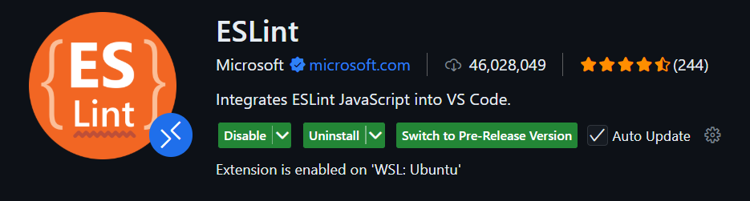
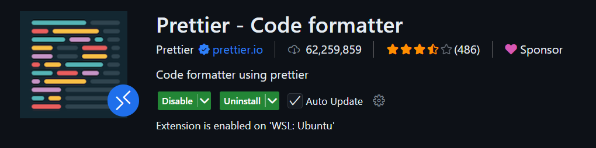

# 🤝 Guia de Contribuição – Deckify

Obrigado por se interessar em contribuir com o Deckify!
Este documento explica como configurar o ambiente local, seguir os padrões do projeto e abrir Pull Requests de forma adequada.

## 🧭 Visão Geral

O Deckify é uma plataforma open source de estudos com flashcards, onde as coleções podem ser criadas com auxílio de AI e compartilhadas pela comunidade.
O projeto é um monorepo com duas principais partes:

- Frontend – Aplicação web desenvolvida em Next.js, gerenciada com Yarn
- Backend – API desenvolvida em FastAPI, com gerenciamento de dependências via Astral UV

## 🛠️ Como configurar o ambiente local

### 1. Clonar o repositório

```bash
git clone https://github.com/davi-lucciola/deckify.git
cd deckify
```

### 2. Configurar o ambiente

Certifique-se de ter instalados:

- Python 3.13+
- Astral UV
- Node.js 20+
- Yarn
- Docker e Docker Compose (para ambiente de integração ou banco de dados local)

Após instalar, você pode instalar as dependências dos projetos localmente seguindo os passos abaixo:

- Backend

  ```bash
  cd backend
  uv sync
  ```

- Frontend

  ```bash
  cd frontend
  yarn install
  ```

### 3. Rodar os serviços localmente

Primeiro será necessário rodar os containers com o docker.

```bash
docker compose up -d
```

Depois, ao desenvolver um dos serviços, você deverá parar o container e rodar localmente utilizando os comandos abaixo

- Backend

  ```bash
  cd backend
  task dev
  ```

- Frontend

  ```bash
  cd frontend
  yarn dev
  ```

O projeto será iniciado e estará disponível em:

- API → http://localhost:8000
- Web → http://localhost:3000

## 🧪 Rodando testes e formatadores

- Backend

  ```bash
  task format
  task test
  ```

- Frontend

  ```bash
  yarn format
  yarn test
  ```

Antes de abrir um PR, todos os testes e linters devem passar localmente.

(WIP) Caso os testes e o linter não passem a pipeline de CI não permitirá o Merge do Pull Request

### Configurando Formatação ao Salvar

Antes de mais nada, para habilitar a formatação ao salvar é preciso adicionar a configuração abaixo no arquivo "settings.json" em "Preferences: Open User Settings (JSON)"

```json
{
  "editor.formatOnSave": true
}
```

#### Frontend

Para configurar as estensões do linter e formatador do frontend, será necessário instalar as extensões do `ESLint` e do `Prettier`.




Após isso, abra o arquivo "settings.json" em "Preferences: Open User Settings (JSON)", e adicione as linhas abaixo:

```json
{
  "[typescriptreact]": {
    "editor.defaultFormatter": "esbenp.prettier-vscode",
    "editor.codeActionsOnSave": {
      "source.fixAll.eslint": "always"
    }
  },
  "[javascript]": {
    "editor.defaultFormatter": "esbenp.prettier-vscode",
    "editor.codeActionsOnSave": {
      "source.fixAll.eslint": "always"
    }
  }
}
```

## 🌿 Estrutura de Branches

| Tipo de Branch | Descrição                               | Exemplo              |
| -------------- | --------------------------------------- | -------------------- |
| main           | Branch de produção (estável, protegida) | —                    |
| dev            | Branch de integração e desenvolvimento  | —                    |
| feat/<nome>    | Nova feature                            | feat/deck-creation   |
| bugfix/<nome>  | Correção de bug                         | bugfix/card-render   |
| docs/<nome>    | Alterações de documentação              | docs/update-readme   |
| infra/<nome>   | Alterações de infraestrutura ou CI/CD   | infra/github-actions |

## 🧾 Padrão de Commits

O projeto segue o padrão Custom Conventional Commits, adaptado para monorepos.

```
<scope>(<type>/<nome>): <descrição>
```

Exemplos:

```
backend(feat/deck-service): add create deck endpoint
frontend(bugfix/flashcard-ui): fix flashcard flip animation
infra(feat/ci): add workflow for lint and test
docs(feat/readme): update contributing section
```

Tipos permitidos:

- feat → Nova funcionalidade
- bugfix → Correção de bug
- test → Criação ou melhoria de testes
- docs → Alterações de documentação
- infra → Infraestrutura, CI/CD, DevOps

## 🚀 Pull Requests

Todas as alterações devem ser enviadas via Pull Request (PR).

Regras:

- Crie uma branch a partir de dev
- Faça commits seguindo o padrão acima
- Garanta que o lint, build e testes passem localmente
- Preencha o template de PR (.github/PULL_REQUEST_TEMPLATE.md)
- O PR será analisado e precisa passar na pipeline de CI (build, lint, tests)

### ✅ Checklist antes do PR

- Todos os testes passam (task test / yarn test)
- Código formatado (task format / yarn format)
- Commits seguem o padrão
- PR preenche corretamente o template
- Nenhum arquivo irrelevante (logs, cache, etc.)

### 🧑‍💻 Revisão de Código

- Mantenedores revisarão o PR verificando:

  - Clareza e escopo do código
  - Nomeação de commits e branches
  - Cobertura de testes
  - Impacto em outras partes do monorepo

- O merge será feito apenas após aprovação e sucesso no pipeline de CI.
