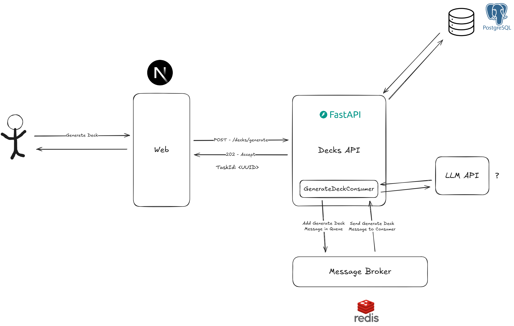

# Deckify

Esse projeto é uma plataforma de estudos através de FlashCards, onde as coleções de Flash Cards podem ser geradas utilizando AI e também compartilhadas com a comunidade

## Glossário

- **Flash Card**: Um cartão de estudos que contém um conteúdo (texto/imagem/gif) de pergunta e uma resposta.
- **Deck**: Coleção de **flash cards** voltado para estudar um tema especifico, que é categorizado pelas suas **tags**
- **Tag**: Uma palavra chave que será utilizada para pesquisa e categorização dos **decks**.
- **Estudo**: Uma sessão de estudo com **flash cards**, onde eles aparecerão aleatoriamente e baseado na dificuldade do estudante em responder as perguntas.
- **Biblioteca**: Repositório de **decks** publicos que os **usuários** podem buscar **decks** para estudar.
- **Avaliação**: É uma recomendação ou não recomendação de um **deck**, pode conter um comentário e também outros **usuários** podem votar sobre a utilidade da **avaliação**.
- **Usuário**: O estudante que utiliza o app e pode criar **decks**, **flash cards**, navegar na **biblioteca** e fazer **avaliações**

## Arquitetura

### Stack

- Web App: NextJS

- Decks API: FastAPI

  - AI Library: Langchain?/PydanticAI?
  - LLM API: ?
  - Consumer Library: FastStream?/Celery?/Taskiq?

- Database: PostgreSQL
- Message Broker: Redis
- Object Store: S3?/Azure Blob?/Supabase?

- Authentication:

  - Manager: Pending (FastAPI provalemente)
  - Provider: Pending (Implementação propria provavelmente)

### Decisões

- Web App

  - Foi escolhido o [NextJS](https://nextjs.org/) por conta das funcionalidades proporcionadas por ele de utilizar Server side rendering e cache, dado que foi avaliado um bom caso de uso para a página da biblioteca que será compartilhada entre usuários.
  - Dado a proximidade do grupo com o [React](https://react.dev/) a curva de aprendizado será baixa, e é esperado que os desenvolvedores se aprendam rapidamente.

- Decks API

  - Foi escolhido [Python](https://www.python.org/) por conta das funcionalidades utilizando AI
  - o [FastAPI](https://fastapi.tiangolo.com/) foi selecionado por ter suporte assíncrono nativo (proporcionado pelo [uvicorn](https://uvicorn.dev/) e o [uvloop](https://uvloop.readthedocs.io/))
  - o [FastAPI](https://fastapi.tiangolo.com/) também tem a capacidade de processar tarefas em background, com o BackgroundTasks ou em conjunto com libs assíncronas como [aio-pika](https://docs.aio-pika.com/), [redis](https://redis.readthedocs.io/en/latest/), [faststream](https://faststream.ag2.ai/latest/)

- Database:

  - Após avaliar as vantagens e desvantagens entre um banco de dados orientado a documentos (NoSQL) e um banco de dados relacional para esse caso de uso, foi concluído que não havia muitas diferenças. Por tanto o [PostgreSQL](https://www.postgresql.org/) foi escolhido pela proximidade dos integrantes com banco de dados relacionais e o ORM [SQLAlchemy](https://www.sqlalchemy.org/).

- Message Broker:

  - O [Redis](https://redis.io/) foi selecionado pela sua simplicidade no sistema de entrega de mensagens (Pub e Sub) em comparação ao RabbitMQ ou o Apache Kafka
  - O [Redis](https://redis.io/) também possibilita a sua utilização como banco de dados chave e valor para implementação de funcionalidades futuras.

## Como Rodar

- rodar o comando no terminal 

`
  docker-compose up --build
`
- lembre-se de estar no diretório raiz do projeto ao dar este comando.
`.../deckify/`

- Para acessar a aplicação acesse o link a seguir: http://localhost:3000/

- você pode também, acessar a documentação da api em: http://localhost:8000/docs 

